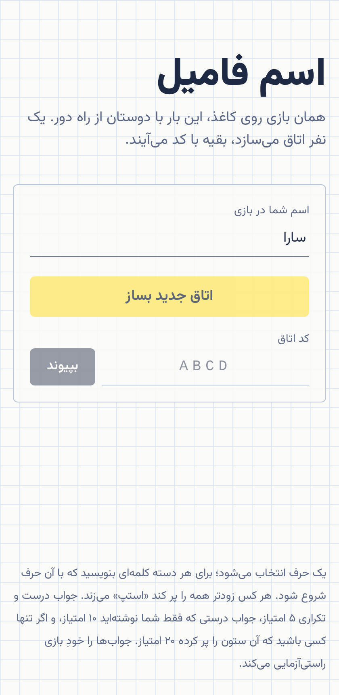
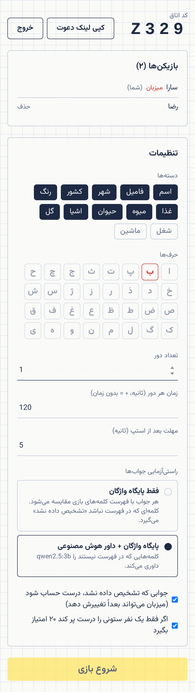
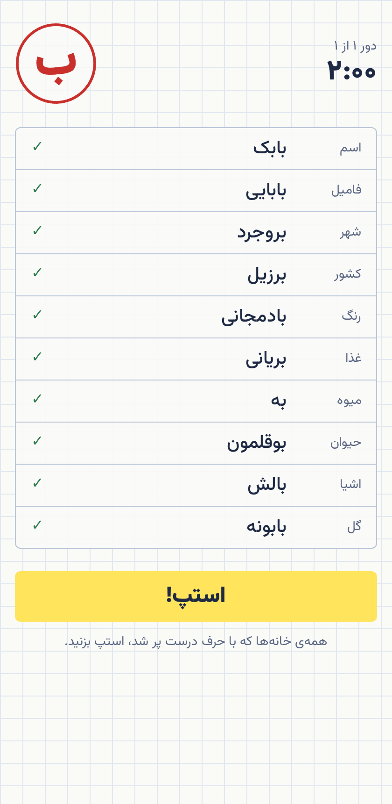
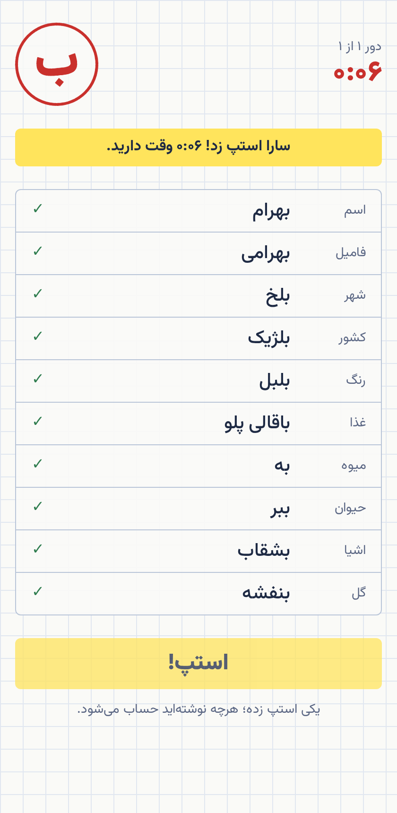
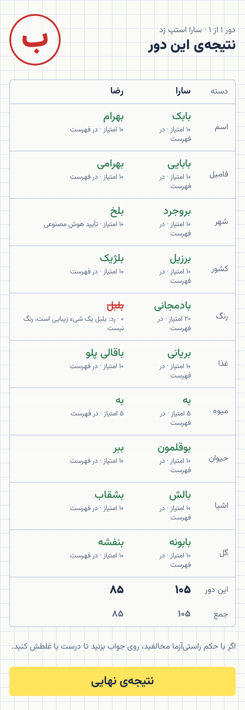
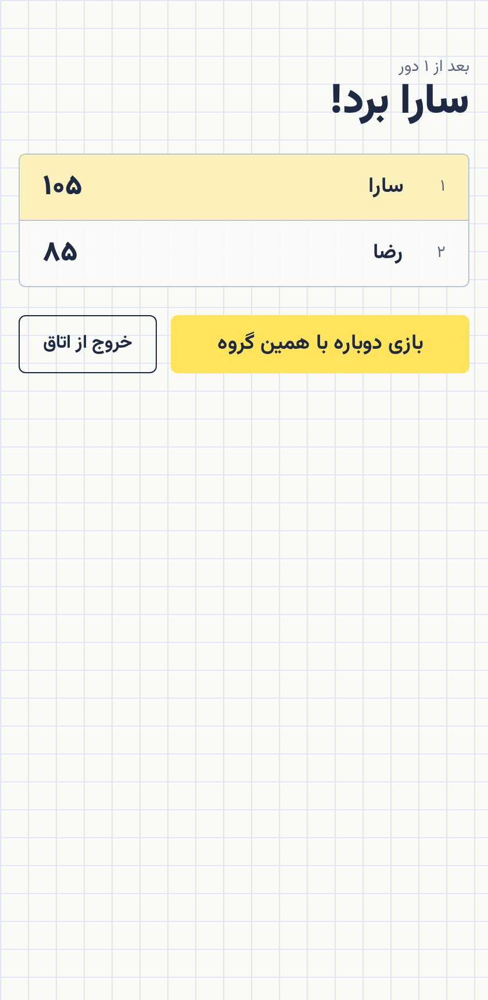
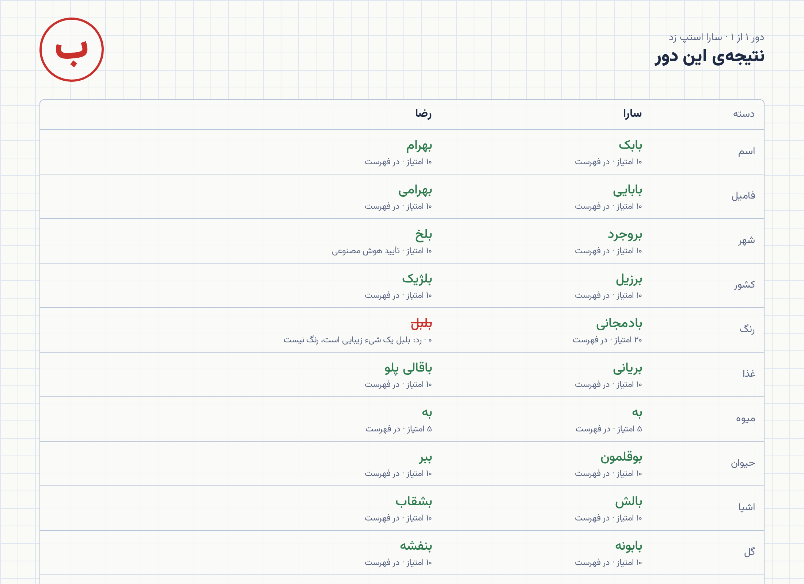

# esm-famil · اسم فامیل

Online multiplayer version of the Persian pen-and-paper word game اسم فامیل (the Iranian
Scattergories). One player creates a room, friends join with a 4-letter code or an invite link,
a random letter is drawn, everyone fills in a word per category, and the first to finish shouts
«استپ». The server fact-checks every answer and scores the round.

## Rules implemented

- Categories: اسم، فامیل، شهر، کشور، رنگ، غذا، میوه، حیوان، اشیا، گل (+ شغل، ماشین). The host picks
  which ones to play and which letters go in the pool (rare letters like ث ذ ژ ض ظ غ are off by default).
- A round ends when someone calls استپ (others get a short grace period) or when the round timer runs out.
- Scoring per cell: valid answer nobody else wrote **10**, valid answer someone else also wrote **5**,
  the only valid answer in the column **20** (optional), empty / invalid **0**.
- Fact-checking has two modes the host picks per room:
  1. **Word database only** — the answer must start with the letter and match the bundled Persian
     word database (≈4,700 entries across the 12 categories, plus a surname heuristic for فامیل).
     Anything unknown is flagged «تشخیص داده نشد» and counted according to the room's policy.
  2. **Word database + LLM judge** — the same, but unknown answers are sent to a language model
     (Claude through the Anthropic API, or a local Ollama model) that rules on them with a short
     reason. Available when the server is started with an `LLM_PROVIDER`.

  In both modes the host can flip any verdict in the review screen and scores recompute live.

## Screenshots

| Home                                 | Lobby (host settings)                  | Round                                  |
| ------------------------------------ | -------------------------------------- | -------------------------------------- |
|  |  |  |

| Someone called استپ                  | Review with the LLM judge                | Final                                  |
| ------------------------------------ | ---------------------------------------- | -------------------------------------- |
|  |  |  |



The review above was judged by a local `qwen2.5:3b` through Ollama: «بلخ» is not in the city list
and was accepted by the model, «بلبل» as a colour was rejected with its reason. Regenerate the
images against a running server with `node scripts/screenshots.mjs http://localhost:3000`.

## Getting started

```sh
pnpm install
cp .env.example .env      # optional: LLM_PROVIDER=claude (needs ANTHROPIC_API_KEY) or =ollama
pnpm dev                  # web on http://localhost:5173, API on :3000
```

Production build (one Node process serves both the API and the web app):

```sh
pnpm build && pnpm start   # http://localhost:3000
# or
docker compose up --build
```

## Development

```sh
pnpm test      # unit tests (shared rules, room state machine, validators)
pnpm lint      # prettier --check + typecheck
pnpm format
```

Layout: `packages/shared` (rules, protocol types), `apps/server` (Fastify + socket.io game server),
`apps/web` (React + Vite + Tailwind, RTL). See `CLAUDE.md` for the design notes.
